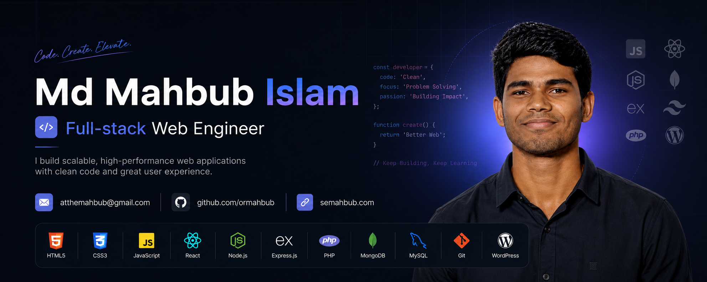
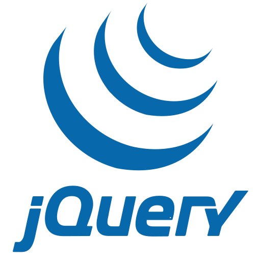
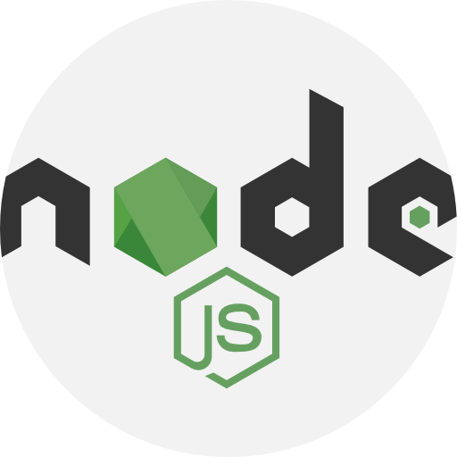
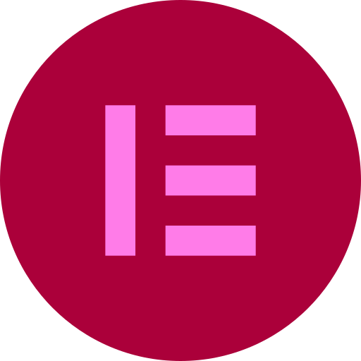
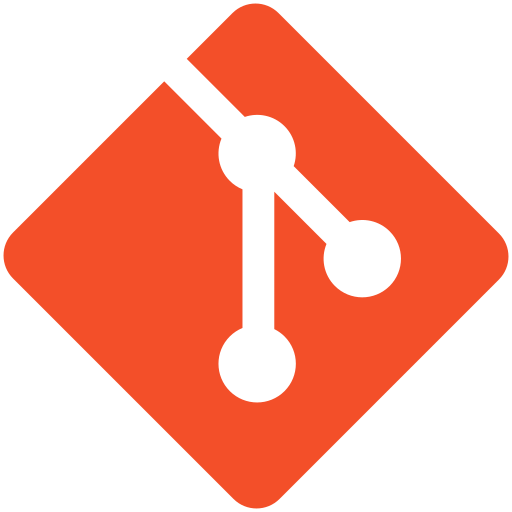
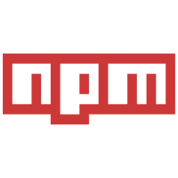

<!-- ========================= -->
<!--        HERO BANNER        -->
<!-- ========================= -->

  

<!-- ========================= -->
<!--       INTRODUCTION        -->
<!-- ========================= -->

<h1 align="center">Hi 👋, I'm Md Mahbub Islam</h1>

<h3 align="center">
  Full-stack Web Engineer · WordPress Engineer · Web Performance Enthusiast
</h3>

  Building reliable, scalable, and performance-focused web solutions.

  
  
  

---

<!-- ========================= -->
<!--         ABOUT ME          -->
<!-- ========================= -->

## 👨‍💻 About Me

I'm a **Full-stack Web Engineer** with **4+ years of professional experience** building, customizing, optimizing, and maintaining production websites and web applications.

My strongest expertise is in **WordPress and WooCommerce engineering**, where I work with custom functionality, PHP, JavaScript, dynamic content, APIs, performance optimization, debugging, and production problem-solving.

I enjoy understanding how systems work beneath the surface—not just making a website look good, but investigating problems and building solutions that are **reliable, maintainable, scalable, and performant**.

Currently, I'm expanding my engineering skills toward modern full-stack development with **JavaScript, React, Next.js, Node.js, Express.js, MySQL, and MongoDB**.

> 💡 **I don't just build websites. I solve problems and engineer reliable web solutions.**

---

<!-- ========================= -->
<!--       CURRENT FOCUS       -->
<!-- ========================= -->

## 🚀 What I'm Currently Working On

- 🔭 Working on production-level **WordPress and WooCommerce projects**
- ⚙️ Building and improving **custom WordPress functionality using PHP and JavaScript**
- ⚡ Improving website **performance, Core Web Vitals, and reliability**
- 🌱 Learning and exploring **React, Next.js, and modern JavaScript**
- 🧠 Expanding toward **full-stack web engineering**
- 🛠️ Improving my knowledge of **clean code, system architecture, debugging, and scalable applications**
- 💻 Building personal projects and strengthening my modern development portfolio

---

<!-- ========================= -->
<!--       TECH STACK          -->
<!-- ========================= -->

## 🛠️ Technical Stack

### Frontend

  
  
  
  
  
  
  

### Backend & Databases

  
  
  
  
  

### WordPress & CMS

  
  
  
  
  

### Tools & Workflow

  
  
  
  
  
  

---

<!-- ========================= -->
<!--     WHAT I SPECIALIZE IN  -->
<!-- ========================= -->

## ⚡ What I Specialize In

<table>
<tr>

<td width="50%">

### 🏗️ WordPress Engineering

- Custom WordPress Development
- WooCommerce Development
- Custom Themes
- Custom Functionality
- Elementor Pro Development
- Custom Post Types
- WordPress REST API

</td>

<td width="50%">

### 🚀 Performance & Problem Solving

- Website Speed Optimization
- Core Web Vitals
- Production Debugging
- Technical Troubleshooting
- Website Maintenance
- Security & Stability
- Performance Optimization

</td>

</tr>
</table>

---

<!-- ========================= -->
<!--        EXPERIENCE         -->
<!-- ========================= -->

## 💼 Professional Experience

### 🧑‍💻 Full-stack WordPress Developer

**Tech Maximus · Dhaka, Bangladesh**  
📅 **2025 — Present**

Working on production-level WordPress and WooCommerce projects involving:

- Custom development and functionality
- PHP and JavaScript solutions
- Elementor Pro development
- WooCommerce customization
- Website troubleshooting and debugging
- Performance optimization
- Production maintenance and support

### 🌍 WordPress Front-end Developer

**Webkonsulterne · Remote**  
📅 **2023 — 2025**

Worked with international clients and remote teams to:

- Build responsive WordPress websites
- Develop user-focused interfaces
- Improve website usability and performance
- Solve technical problems
- Collaborate with clients and development teams

### 🚀 Freelance WordPress Developer

**Fiverr & Independent Projects · Global**  
📅 **2021 — 2023**

Delivered web solutions for clients across different industries, including:

- WordPress website development
- Website customization
- Performance optimization
- Technical troubleshooting
- Responsive development
- Client communication and project delivery

---

<!-- ========================= -->
<!--       FEATURED WORK       -->
<!-- ========================= -->

## 📌 What I Build

🌐 Custom WordPress Websites  
🛒 WooCommerce Stores  
⚙️ Custom WordPress Functionality  
🧩 Custom Themes & Plugins  
📊 Dynamic Web Applications  
⚡ Performance-Optimized Websites  
🎨 Modern Frontend Interfaces  
🔗 API-Integrated Web Solutions

---

<!-- ========================= -->
<!--       GITHUB STATS        -->
<!-- ========================= -->

## 📊 GitHub Stats

  
  

## 🔥 Contribution Streak

  

## 📈 Contribution Activity

  

---

<!-- ========================= -->
<!--       CONNECT WITH ME     -->
<!-- ========================= -->

## 🤝 Let's Connect

🌐 **Portfolio:** [semahbub.com](https://semahbub.com)

💼 **LinkedIn:** [linkedin.com/in/ormahbub](https://linkedin.com/in/ormahbub)

📧 **Email:** [mahbub@semahbub.com](mailto:mahbub@semahbub.com)

---

<!-- ========================= -->
<!--          FOOTER           -->
<!-- ========================= -->

### 💡 Code with purpose. Build with quality. Keep learning.

  ⭐ Feel free to explore my repositories and connect with me!

